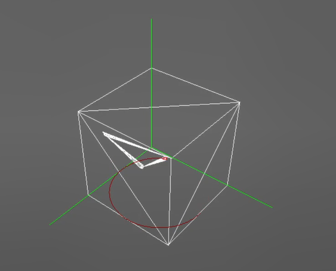

# 可视计算概论 Lab-4

详细代码及视频均开源在：[caolonghao/Visual-Computing-Lab4 (github.com)](https://github.com/caolonghao/Visual-Computing-Lab4)

## 一、弹簧质点

### 弹簧受力计算

```c++
    /*homework: compute the force on the single spring*/
    void Edge::compute_spring_force(Vec3f& force) 
    {
        float length_now = this->get_length();
        // 根据下面的解释，node1是+，因此计算node1收到的力
        force = (this->nodes[1]->position - this->nodes[0]->position).normalized();
        force *= (this->init_length - length_now) * this->k;
    }
```

### Hessian 矩阵计算

```c++
    /* homework: compute the single spring on the Hessian matrix: \partial f^i / \partial x^i*/
    void Edge::compute_hessian_matrix(Mat3f& hessian) 
    {
        Vec3f x_ij = this->nodes[0]->position - this->nodes[1]->position;
        Mat3f Mat_I = Mat3f::Identity();
        hessian = (this->k * x_ij * x_ij.transpose()) / x_ij.norm();
        hessian += this->k * (1 - this->init_length / x_ij.norm()) * (Mat_I - x_ij * x_ij.transpose());
        // 提供的代码中恰好是负的，多乘一个负号
        hessian *= -1.0;
    }
```

### 显式欧拉

```c++
    void DynamicSystem::explicit_euler_step(float dt)
    {
        for (int i = 0; i < this->num_nodes(); i++)
            nodes[i]->force = gravity;

        for (int i = 0; i < this->num_edges(); i++)
        {
            // compute force for each edge
            Edge* edge = edges[i];
            Vec3f force(0, 0, 0);
            edge->compute_spring_force(force);
            edge->nodes[0]->force -= force;
            edge->nodes[1]->force += force;
        }

        // here we use Euler method to solve.
        // compute acc from force
        for (int i = 0; i < this->num_nodes(); i++)
        {
            /* homework: explicit euler (update acceleration, velocity, position) */
            if (!nodes[i]->is_fixed)
            {
                Vec3f acc = nodes[i]->force / nodes[i]->mass;
                nodes[i]->velocity += acc * dt;
                nodes[i]->position += nodes[i]->velocity * dt;
            }
        }
    }
```

### 隐式欧拉

```c++
    void DynamicSystem::implicit_euler_step(float dt)
    {
        for (int i = 0; i < this->num_nodes(); i++)
            nodes[i]->force.setZero();

        std::vector<Tripletf> matrix_elements;
        matrix_elements.clear(); 
        for (int i = 0; i < this->num_edges(); i++)
        {
            // compute force for each edge
            Edge* edge = edges[i];
            Vec3f force(0, 0, 0);
            Mat3f hessian(Mat3f::Zero());
            edge->compute_spring_force(force);
            edge->compute_hessian_matrix(hessian);

            int pid[2] = { edge->node_id[0],edge->node_id[1] };
            if (nodes[pid[0]]->is_fixed && nodes[pid[1]]->is_fixed)continue;

            edge->nodes[0]->force -= force;
            edge->nodes[1]->force += force;

            if (nodes[pid[1]]->is_fixed)
                add_matrix_block(-hessian, &matrix_elements, pid[0], pid[0]);
            else if (nodes[pid[0]]->is_fixed)
                add_matrix_block(-hessian, &matrix_elements, pid[1], pid[1]);
            else {
                add_matrix_block(-hessian, &matrix_elements, pid[0], pid[0]);
                add_matrix_block(-hessian, &matrix_elements, pid[1], pid[1]);
                add_matrix_block(hessian, &matrix_elements, pid[1], pid[0]);
                add_matrix_block(hessian, &matrix_elements, pid[0], pid[1]);
            }
        }

        VecXf deriv = VecXf::Zero(this->num_nodes() * 3);
        VecXf delta_x = VecXf::Zero(this->num_nodes() * 3);
        SpMatf Hess(this->num_nodes() * 3, this->num_nodes() * 3);

        for (int i = 0; i < this->num_nodes(); i++) {
            // 大 Hess 保存了 F 关于 x 的Hessian矩阵
            for (int row = 0; row < 3; row++)
                matrix_elements.push_back(Tripletf(3 * i + row, 3 * i + row, nodes[i]->mass / dt / dt));
            Vec3f y = nodes[i]->position + dt * nodes[i]->velocity + dt * dt * gravity;
            // F 关于 x 的导数
            if(!nodes[i]->is_fixed)deriv.segment<3>(3 * i) = (nodes[i]->position - y) * nodes[i]->mass / dt / dt - nodes[i]->force;
        }
        Hess.setFromTriplets(matrix_elements.begin(), matrix_elements.end());

        SparseSolver::CG(Hess, delta_x, -deriv);

        /* homework: read the code of implicit euler method in this function, and update the system state*/
        for (int i = 0; i < this->num_nodes(); i++) {
            Vec3f delta_x_i = delta_x.segment<3>(3 * i);
            nodes[i]->position += delta_x_i;
            // Vec3f pre_velocity = nodes[i]->velocity;
            nodes[i]->velocity = delta_x_i / dt;
        }

    }
```

### 效果展示

#### 显式欧拉


---

#### 隐式欧拉


## 二、逆向运动学

### CCD IK

```c++
void SimpleArm::ccd_ik(const Vec3f& end_position, int maxCCDIKIteration, float eps)
    {
        // Implement CCD IK here
        this->forward_kinematics(0);
        for(int CCDIKIteration = 0; CCDIKIteration < maxCCDIKIteration && (end_effector_pos() - end_position).norm() > eps; CCDIKIteration++)
        {
            for (int i = this->num_joints() - 2; i >= 0; i--)
            {
                // homework: create rotation of i-th joint
                this->forward_kinematics(i);
                Vec3f chain_top_point = joint_position[this->num_joints() - 1];
                Vec3f link_root = joint_position[i];
                Vec3f root_to_end = (end_position - link_root).normalized();
                Vec3f root_to_top = (chain_top_point - link_root).normalized();


            /*  // Simple Rotation 
                // 利用叉积找到法向量作为旋转轴
                Vec3f rotation_axis = root_to_top.cross(root_to_end);
                float k = root_to_end.dot(root_to_top) + 1.0f;
                float s = 1.0 / sqrt(k + k);
                Quatf result(k * s, s * rotation_axis(0), s * rotation_axis(1), s * rotation_axis(2));
                // 后施加新的 result 旋转，换序问题要考虑
                joint_rotation[i] = joint_rotation[i] * result;
            */
                
                // More Robust rotation
                Vec3f w;
                float norm_root_end = sqrt(root_to_end.dot(root_to_end) * root_to_top.dot(root_to_top));
                float real_part = norm_root_end + root_to_end.dot(root_to_top);
                if (real_part < 1.e-6f * norm_root_end) {
                    real_part = 0.0f;
                    w = abs(root_to_top(0)) > abs(root_to_top(2)) ? Vec3f(-root_to_top(1), root_to_top(0), 0.f)
                                                                  : Vec3f(0.f, -root_to_top(2), root_to_top(1));
                }
                else {
                    w = root_to_top.cross(root_to_end);
                }
                Quatf result(real_part, w(0), w(1), w(2));
                joint_rotation[i] = joint_rotation[i] * result.normalized();
            }
        }
        this->forward_kinematics(0);
    }
```

### FABR IK

```c++
void SimpleArm::fabr_ik(const Vec3f& end_position, int maxFABRIKIteration, float eps)
    {
        // Implement fabr ik here
        this->forward_kinematics(0);
        int n_joints = this->num_joints();
        std::vector<Vec3f> backward_positions(n_joints, Vec3f::Zero()), forward_positions(n_joints, Vec3f::Zero());
        for (int IKIteration = 0; IKIteration < maxFABRIKIteration && (end_effector_pos() - end_position).norm() > eps; IKIteration++)
        {
            // backward update
            Vec3f next_position = end_position;
            backward_positions[n_joints - 1] = end_position;
            for (int i = n_joints - 2; i >= 0; i--)
            {
                // homework: compute the positions in backward processing
                Vec3f dir = (joint_position[i] - next_position).normalized();
                next_position = next_position + dir * joint_offset_len[i];
                backward_positions[i] = next_position;
            }

            // forward update
            Vec3f now_position = this->joint_position[0];
            forward_positions[0] = this->joint_position[0];

            for (int i = 0; i < n_joints - 1; i++)
            {
                // homework: compute the position in forward processing
                Vec3f dir = (backward_positions[i+1] - now_position).normalized();
                now_position = now_position + joint_offset_len[i] * dir;
                forward_positions[i+1] = now_position;
            }

            // copy forward positions to joint_positions
            joint_position = forward_positions;
        }
        // Compute joint rotation by position here.
        for (int i = 0; i < n_joints - 1; i++)
        {
            this->joint_orientation[i] = Quatf::FromTwoVectors(this->joint_offset[i + 1], this->joint_position[i + 1] - this->joint_position[i]);
        }
        this->joint_rotation[0] = this->joint_orientation[0];
        for (int i = 1; i < n_joints - 1; i++)
        {
            this->joint_rotation[i] = this->joint_orientation[i - 1].conjugate() * this->joint_orientation[i];
        }
        this->forward_kinematics(0);
    }
```

### 效果展示

#### CCD IK





---

#### FABR IK


---

#### CCD IK with more arms

表现得不稳定，画圈后时候会出现坑洼漂移，存在奇怪的抖动


#### FABR IK more arms

在多轮间表现得更为稳定，整体机械臂动作也更为平滑，没有奇怪的抖动


---

### 数字与字母绘制 (使用FABR)

#### 数字2


#### 数字5


#### 字母CLH合并 logo


